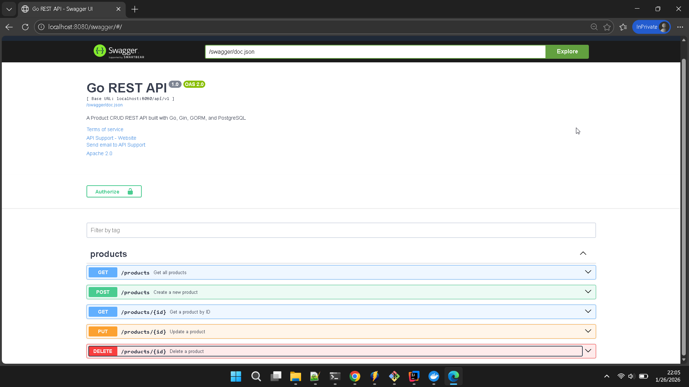

# Go REST API

A complete REST API built with Go, featuring Product CRUD operations, PostgreSQL database, Swagger UI documentation, and Docker Compose orchestration.

## Tech Stack

- **Go**: 1.25.6
- **Web Framework**: Gin
- **ORM**: GORM
- **Database**: PostgreSQL
- **API Documentation**: Swagger UI
- **Containerization**: Docker Compose

## Features

- Product CRUD operations (Create, Read, Update, Delete)
- RESTful API design
- PostgreSQL database with GORM ORM
- Swagger UI documentation
- Docker Compose for easy deployment
- Unit tests with mock repository
- Environment-based configuration
- Input validation
- Pagination support


## Getting Started

### Prerequisites

- Go 1.25.6 or higher
- Docker and Docker Compose
- PostgreSQL (if running locally)

### Running with Docker Compose (Recommended)

1. Clone the repository
2. Copy environment template:
   ```bash
   cp .env.example .env
   ```
3. Start the services:
   ```bash
   docker-compose up --build
   ```
4. Access the API at `http://localhost:8080`
5. Access Swagger UI at `http://localhost:8080/swagger/index.html`

### Running Locally

1. Install dependencies:
   ```bash
   go mod download
   ```

2. Set up PostgreSQL database

3. Configure environment variables (copy `.env.example` to `.env` and update)

4. Run the application:
   ```bash
   go run cmd/server/main.go
   ```

## API Endpoints

### Products

| Method | Endpoint | Description |
|--------|----------|-------------|
| POST | `/api/v1/products` | Create a new product |
| GET | `/api/v1/products` | Get all products (with pagination) |
| GET | `/api/v1/products/:id` | Get a product by ID |
| PUT | `/api/v1/products/:id` | Update a product |
| DELETE | `/api/v1/products/:id` | Delete a product |

### Health Check

| Method | Endpoint | Description |
|--------|----------|-------------|
| GET | `/ping` | Health check endpoint |

## Example Usage

### Create a Product

```bash
curl -X POST http://localhost:8080/api/v1/products \
  -H "Content-Type: application/json" \
  -d '{
    "name": "Gaming Laptop",
    "description": "High-performance gaming laptop",
    "price": 1500.00,
    "stock": 10
  }'
```

### Get All Products

```bash
curl http://localhost:8080/api/v1/products?page=1&limit=10
```

### Get a Product by ID

```bash
curl http://localhost:8080/api/v1/products/1
```

### Update a Product

```bash
curl -X PUT http://localhost:8080/api/v1/products/1 \
  -H "Content-Type: application/json" \
  -d '{
    "name": "Updated Gaming Laptop",
    "description": "High-end gaming laptop",
    "price": 1800.00,
    "stock": 5
  }'
```

### Delete a Product

```bash
curl -X DELETE http://localhost:8080/api/v1/products/1
```

## Running Tests

Run all tests:
```bash
go test ./... -v
```

Run tests with coverage:
```bash
go test ./... -cover
```

## Configuration

The application uses environment variables for configuration. See `.env.example` for available options:

- `SERVER_PORT`: Server port (default: 8080)
- `DB_HOST`: Database host (default: localhost)
- `DB_PORT`: Database port (default: 5432)
- `DB_USER`: Database user (default: postgres)
- `DB_PASSWORD`: Database password (default: postgres)
- `DB_NAME`: Database name (default: go_rest_db)
- `DB_SSLMODE`: SSL mode (default: disable)

## Swagger Documentation

Access the Swagger UI documentation at:
```
http://localhost:8080/swagger/index.html
```



This provides an interactive API documentation where you can test all endpoints with:
- Request duration display
- Syntax highlighting
- Try it out functionality
- Request/response examples

## Docker Commands

### Build and start services
```bash
docker-compose up -d
```

### Stop services
```bash
docker-compose down
```

### View logs
```bash
docker-compose logs -f
```

### Execute commands in container
```bash
docker-compose exec api /bin/sh
```

## Development

### Adding New Features

1. Add your model in `internal/models/`
2. Create repository in `internal/repository/`
3. Add handlers in `internal/handlers/`
4. Register routes in `cmd/server/main.go`
5. Add Swagger annotations to handlers
6. Regenerate Swagger docs:
   ```bash
   swag init -g cmd/server/main.go -o docs/swagger
   ```
